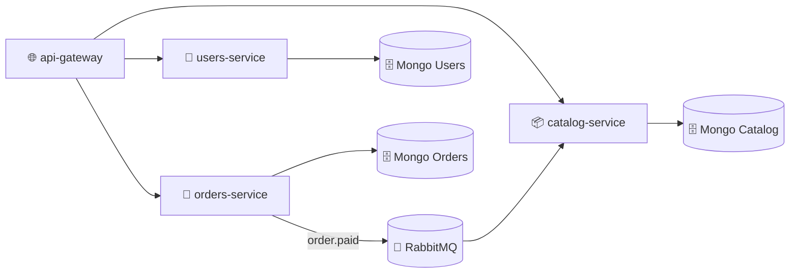
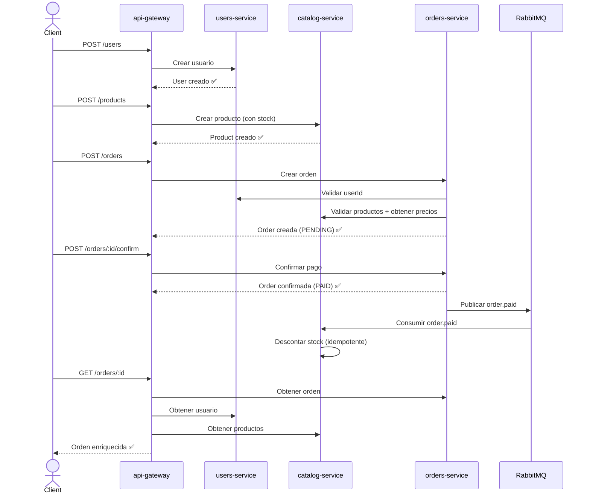

# 🛒 MiniCommerce — Microservices Challenge

> **NestJS · MongoDB · RabbitMQ · Docker Compose · CI/CD**

Un sistema de pedidos **production-minded** con API Gateway, microservicios independientes, mensajería event-driven, resiliencia (Circuit Breaker), observabilidad (metrics + health), Swagger, tests y CI.

---

## 📐 Arquitectura



### Servicios

| Servicio            | Responsabilidad                                |
| ------------------- | ---------------------------------------------- |
| **api-gateway**     | HTTP público, Swagger, resiliencia, agregación |
| **users-service**   | Gestión de usuarios                            |
| **catalog-service** | Productos y stock                              |
| **orders-service**  | Órdenes y checkout                             |

### Infraestructura

| Componente       | Rol                                           |
| ---------------- | --------------------------------------------- |
| **MongoDB** (×3) | Una instancia por servicio (aislamiento real) |
| **RabbitMQ**     | Event bus para comunicación entre servicios   |
| **Prometheus**   | Scrape de métricas (opcional Grafana)         |

### Comunicación

| Dirección             | Protocolo                           |
| --------------------- | ----------------------------------- |
| Gateway → Servicios   | HTTP (REST)                         |
| Servicios ↔ Servicios | Event-driven con RabbitMQ (pub/sub) |

---

## 🔄 Flujo Principal (Happy Path)



---

## 📋 Requisitos Funcionales

### 👤 Users

| Endpoint         | Descripción            |
| ---------------- | ---------------------- |
| `POST /users`    | Crear usuario          |
| `GET /users/:id` | Obtener usuario por id |

**Entidad `User`:**

```typescript
{
  name: string;
  email: string; // único
}
```

### 📦 Catalog

| Endpoint               | Descripción                                   |
| ---------------------- | --------------------------------------------- |
| `POST /products`       | Crear producto                                |
| `GET /products/:id`    | Obtener producto por id                       |
| `POST /products/batch` | _(Opcional)_ Obtener muchos productos por ids |

> ⚡ El stock se descuenta por **evento** (RabbitMQ), no por endpoint.

**Entidad `Product`:**

```typescript
{
  name: string;
  price: number;
  stock: number;
}
```

### 🧾 Orders

| Endpoint                   | Descripción                                      |
| -------------------------- | ------------------------------------------------ |
| `POST /orders`             | Crear orden                                      |
| `POST /orders/:id/confirm` | Confirmar pago (simulado)                        |
| `GET /orders/:id`          | Obtener orden por id (enriquecida desde gateway) |

**Entidad `Order`:**

```typescript
{
  userId: string;
  items: [{
    productId: string;
    qty: number;
    unitPrice: number;
  }];
  total: number;
  status: 'PENDING' | 'PAID' | 'CANCELLED';
  version: number;  // para idempotencia/optimismo (opcional)
  createdAt: Date;
  updatedAt: Date;
}
```

**Reglas de negocio:**

- ❌ No se puede confirmar una orden ya `PAID`
- 🧮 `total = Σ(qty × unitPrice)`
- 🔒 `unitPrice` se **congela** al crear la orden (precio del momento)
- 🚫 Si falla la validación de user/product, **no se crea** la orden

---

## ⚙️ Requisitos No-Funcionales

### 1) API Gateway — DX & Resiliencia

El gateway expone los endpoints públicos y es el único servicio con **Swagger / OpenAPI**.

| Feature             | Descripción                                               |
| ------------------- | --------------------------------------------------------- |
| **Aggregation**     | `GET /orders/:id` enriquece con datos de user + productos |
| **Timeouts**        | Límite de tiempo por request downstream                   |
| **Retries**         | Con backoff exponencial                                   |
| **Circuit Breaker** | Por endpoint downstream (open / half-open / closed)       |
| **Correlation ID**  | Propaga `x-correlation-id` a todos los servicios          |
| **Error handling**  | Formato de error consistente (ver abajo)                  |

**Formato de errores estándar:**

```json
{
  "error": {
    "code": "DOWNSTREAM_UNAVAILABLE",
    "message": "Users service temporarily unavailable",
    "correlationId": "uuid",
    "details": {
      "service": "users",
      "endpoint": "GET_/users/:id"
    }
  }
}
```

### 2) Observabilidad

Todos los servicios exponen:

| Endpoint       | Descripción             |
| -------------- | ----------------------- |
| `GET /health`  | Health check (Terminus) |
| `GET /metrics` | Métricas Prometheus     |

El gateway expone **métricas adicionales**:

- Estado del circuit breaker (`open` / `half-open` / `closed`)
- Latencia por downstream endpoint
- Cantidad de errores por downstream

### 3) Mensajería — RabbitMQ

**Exchange:** `domain.events` (tipo `topic`)

| Evento            | Productor      | Consumidor      | Requerido   |
| ----------------- | -------------- | --------------- | ----------- |
| `order.paid`      | orders-service | catalog-service | ✅ Sí       |
| `order.cancelled` | orders-service | catalog-service | 🔶 Opcional |
| `order.created`   | orders-service | users-service   | 🔶 Opcional |

**Contrato del evento `order.paid`:**

```json
{
  "eventId": "uuid",
  "eventType": "order.paid",
  "occurredAt": "2026-02-23T12:34:56.000Z",
  "correlationId": "uuid",
  "data": {
    "orderId": "string",
    "userId": "string",
    "items": [{ "productId": "string", "qty": 2 }]
  }
}
```

**Reglas del consumidor (catalog-service):**

- ✅ **Idempotente**: si el mismo evento llega dos veces, **no descuenta doble**
- 💾 Guardar `eventId` procesado en colección `ProcessedEvents`
- ⚠️ Si no hay stock suficiente → **log + alerta** (opción A, documentada como decisión arquitectónica)

> **📝 Decisión de diseño:** Optamos por la Opción A (log + alerta dejando inconsistencia temporal) frente a la Opción B (saga con evento `stock.insufficient`). La Opción B queda como **stretch goal**. Esta decisión es un punto de discusión interesante en entrevista.

### 4) Persistencia — Mongo por Servicio

- Cada servicio usa su **propia instancia de MongoDB** (aislamiento real)
- **Mongoose** + schemas + indexes
- Validación de DTOs con **class-validator**

### 5) Testing

| Tipo           | Alcance mínimo                                                                                                |
| -------------- | ------------------------------------------------------------------------------------------------------------- |
| **Unit tests** | Cálculo de total y transición de estados (orders), descuento idempotente de stock (catalog)                   |
| **E2E test**   | Flujo completo: crear user → crear product → crear order → confirmar → stock update → fetch orden enriquecida |

### 6) Docker Compose

Levantar **todo** con un solo comando:

```bash
docker compose up --build
```

Contenedores:

- 4 apps (gateway + 3 servicios)
- 3 instancias MongoDB
- 1 RabbitMQ
- _(Opcional)_ Prometheus / Grafana

### 7) CI — GitHub Actions

Pipeline básico:

```
install → lint → test → build
```

---

## 🌐 Endpoints — API Gateway

### Users

```
POST   /users        → Crear usuario
GET    /users/:id    → Obtener usuario por id
```

### Products

```
POST   /products          → Crear producto
GET    /products/:id      → Obtener producto por id
POST   /products/batch    → (Opcional) Obtener productos por ids
```

### Orders

```
POST   /orders              → Crear orden
POST   /orders/:id/confirm  → Confirmar pago (simulado)
GET    /orders/:id          → Obtener orden enriquecida (user + productos)
```

---

## 📝 DTOs (Contratos de Datos)

### `CreateUserDto`

```json
{
  "name": "Nico",
  "email": "nico@email.com"
}
```

### `CreateProductDto`

```json
{
  "name": "Keyboard",
  "price": 49.99,
  "stock": 10
}
```

### `CreateOrderDto`

```json
{
  "userId": "string",
  "items": [{ "productId": "string", "qty": 2 }]
}
```

---

## ✅ Criterios de Aceptación

Se considera **"terminado"** cuando:

- [ ] `docker compose up --build` levanta todo sin pasos manuales
- [ ] Swagger funciona en `api-gateway`
- [ ] Circuit breaker actúa (se puede demostrar apagando un servicio)
- [ ] `/metrics` y `/health` existen en todos los servicios
- [ ] Confirmar una orden publica `order.paid`
- [ ] `catalog-service` consume `order.paid` y descuenta stock
- [ ] Consumer es idempotente (mismo evento no descuenta dos veces)
- [ ] Hay al menos 1 test E2E del flujo completo
- [ ] CI corre en GitHub Actions

---

## 🚀 Extras "Muy Pro" (Stretch Goals)

| Feature               | Descripción                                                 |
| --------------------- | ----------------------------------------------------------- |
| **Outbox Pattern**    | Publicación confiable desde `orders-service` (Mongo outbox) |
| **Saga básica**       | Si stock insuficiente → emitir evento → orders cancela      |
| **Rate limit**        | En gateway                                                  |
| **Cache de lectura**  | Redis en gateway para user/product                          |
| **Dashboard Grafana** | Latencias, breakers abiertos, errores por servicio          |
| **K6 Load Test**      | Demostrar que el breaker protege bajo carga                 |

---

## 📁 Estructura del Repo

```
apps/
  api-gateway/          # HTTP público, Swagger, resiliencia
  users-service/        # Gestión de usuarios
  catalog-service/      # Productos y stock
  orders-service/       # Órdenes y checkout
libs/
  common/
    breaker/            # Circuit breaker wrapper
    metrics/            # Prometheus metrics helpers
    rabbit/             # RabbitMQ pub/sub helpers
    correlation-id/     # Middleware de correlación
    errors/             # Error shapes y filtros
docker-compose.yml
README.md
.github/
  workflows/
    ci.yml              # GitHub Actions pipeline
```

---

## 🗓️ Plan de Implementación (PRs)

| #   | PR                  | Contenido                                            |
| --- | ------------------- | ---------------------------------------------------- |
| 1   | **Skeleton**        | Monorepo NestJS + Docker Compose (Mongos + RabbitMQ) |
| 2   | **Users Service**   | Mongoose + health + metrics                          |
| 3   | **Catalog Service** | Mongoose + health + metrics                          |
| 4   | **Orders Service**  | Mongoose + health + metrics                          |
| 5   | **RabbitMQ Events** | Publicar `order.paid` + consumir y descontar stock   |
| 6   | **Gateway**         | Swagger + HTTP clients + aggregation                 |
| 7   | **Resiliencia**     | Retry + timeout + circuit breaker + métricas         |
| 8   | **Testing**         | Unit tests + E2E                                     |
| 9   | **CI + Polish**     | GitHub Actions + README (diagramas, decisiones)      |

---

## 🧰 Tech Stack

| Categoría         | Tecnología                                   |
| ----------------- | -------------------------------------------- |
| **Framework**     | [NestJS](https://nestjs.com/) (monorepo)     |
| **Lenguaje**      | TypeScript                                   |
| **Base de datos** | MongoDB + Mongoose                           |
| **Mensajería**    | RabbitMQ (amqplib / `@nestjs/microservices`) |
| **Docs API**      | Swagger / OpenAPI (`@nestjs/swagger`)        |
| **Health**        | `@nestjs/terminus`                           |
| **Métricas**      | `prom-client` / Prometheus                   |
| **Resiliencia**   | `opossum` (Circuit Breaker)                  |
| **Validación**    | `class-validator` + `class-transformer`      |
| **Testing**       | Jest (unit + e2e)                            |
| **Contenedores**  | Docker + Docker Compose                      |
| **CI/CD**         | GitHub Actions                               |

---

## 🏃 Quick Start

```bash
# Clonar el repo
git clone git@github.com:nicopatoco/MicroservicesChallengeNestJs.git
cd MicroservicesChallengeNestJs

# Levantar todo
docker compose up --build

# Swagger UI
open http://localhost:3000/api

# Health checks
curl http://localhost:3001/health   # users-service
curl http://localhost:3002/health   # catalog-service
curl http://localhost:3003/health   # orders-service

# Métricas
curl http://localhost:3001/metrics
```

---

## 📄 Licencia

MIT

---

<p align="center">
  Built with ❤️ for interview challenges — <strong>production-minded, not production-sized</strong>.
</p>

# deps

npm i @nestjs/config @nestjs/axios axios opossum
npm i @nestjs/mongoose mongoose
npm i @nestjs/swagger swagger-ui-express
npm i prom-client
npm i @nestjs/terminus
npm i -D supertest jest ts-jest @types/supertest
